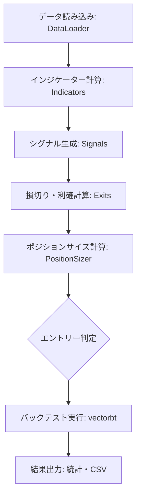

# システム仕様書: VectorBT バックテストツール

## 1. 概要
本プログラムは、`vectorbt` ライブラリを核とし、独自のインジケーター（指標）とシグナル（売買条件）を組み合わせて、株式投資戦略のパフォーマンスを検証（バックテスト）するためのツールです。

## 2. システム構成
モジュール化された設計を採用しており、指標計算、シグナル判定、エグジット管理、ポジションサイジングを分離して管理しています。

- **Indicator (指標)**: EMAやATRなどのテクニカル指標の計算を担当。
- **Signal (シグナル)**: ゴールデンクロスや日付範囲指定など、売買のエントリー/エグジット判定を担当。
- **Exit (エグジット)**: 損切り (Stop Loss) や 利確 (Take Profit) のロジックを担当。
- **Position Sizing (ポジションサイジング)**: 1回あたりの売買数量（株数、金額、資金比率など）の計算を担当。
- **Backtest Engine**: `vectorbt` を使用し、高速なシミュレーションと統計計算を実行。

## 3. 処理フロー

## 4. 詳細仕様

### 4.1 売買ルール（例）

| 種類 | 条件詳細 | 備考 |
| :--- | :--- | :--- |
| **エントリー (買い)** | 全シグナル合致 (AND条件) | 例: ゴールデンクロス + 期間内 + ATR条件 |
| **エグジット (売り)** | 指定シグナル合致 (OR条件) | 例: デッドクロス |
| **損切り (Stop Loss)** | `AbstractStopLoss` 派生クラスで定義 | 動的（ATRベース等）または固定 |
| **利確 (Take Profit)** | `AbstractTakeProfit` 派生クラスで定義 | 動的（ATRベース等）または固定 |

### 4.2 ポジション管理
- `AbstractPositionSizer` を通じて、資金に応じた動的な数量指定が可能。

### 4.3 使用指標
- **EMA (指数平滑移動平均線)**: 短期(5日)、長期(20日)
- **ATR (アベレージ・トゥルー・レンジ)**: 期間(15日)

## 5. 入出力データ

### 5.1 入力
- **銘柄データ**: `7203.T` (トヨタ自動車) 等の株価データ (Open, High, Low, Close)
- **期間**: 2010年1月1日以降のデータ

### 5.2 出力
- **統計サマリ**: 勝率、プロフィットファクター、最大ドローダウン等の統計値をコンソールに表示。
- **取引履歴**: `vectorbt_orders.csv` として、注文の全履歴を出力。

## 6. 主要な関数
- `generate_signals()`: 複数のシグナルオブジェクトをリストで受け取り、それらを統合したブール値の配列を返します。
- `run_vectorbt_backtest()`: バックテストのメインロジック。指標計算、ストップ幅算出、シミュレーション、結果出力までを一括で行います。