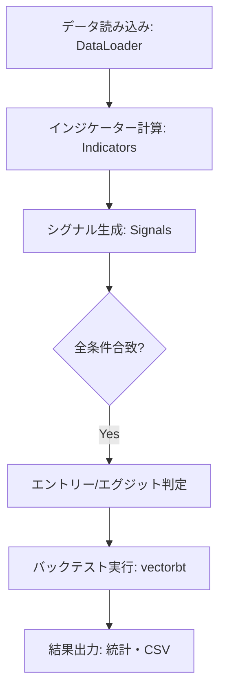

# システム仕様書: VectorBT バックテストツール

## 1. 概要
本プログラムは、`vectorbt` ライブラリを核とし、独自のインジケーター（指標）とシグナル（売買条件）を組み合わせて、株式投資戦略のパフォーマンスを検証（バックテスト）するためのツールです。

## 2. システム構成
モジュール化された設計を採用しており、指標計算とシグナル判定を分離して管理しています。

- **Indicator (指標)**: EMAやATRなどのテクニカル指標の計算を担当。
- **Signal (シグナル)**: ゴールデンクロスや日付範囲指定など、売買の判断条件を担当。
- **Backtest Engine**: `vectorbt` を使用し、高速なシミュレーションと統計計算を実行。

## 3. 処理フロー

## 4. 詳細仕様

### 4.1 売買ルール

| 種類 | 条件詳細 | 備考 |
| :--- | :--- | :--- |
| **エントリー (買い)** | 下記の**すべて**を満たした場合 (AND条件)   1. ゴールデンクロス発生   2. 指定された期間内 (2016/6/25 〜 2030/12/31)   3. ATR条件 (ボラティリティ判定) | `entries` リストの全シグナルが `True` で発動 |
| **エグジット (売り)** | 下記の**いずれか**を満たした場合 (OR条件)   1. デッドクロス発生   2. 動的損切り (SL) に到達   3. 動的利確 (TP) に到達 | `exits` シグナルに加え、動的ストップが優先される |

### 4.2 動的ストップロス・利確設定
ATR（真の実効レンジ）に基づき、ボラティリティに応じて価格変動幅を動的に変更します。

- **損切り (Stop Loss)**: 直近ATRの **2.0倍** の下落
- **利確 (Take Profit)**: 直近ATRの **4.0倍** の上昇

### 4.3 使用指標
- **EMA (指数平滑移動平均線)**: 短期(5日)、長期(20日)
- **ATR (アベレージ・トゥルー・レンジ)**: 期間(15日)

## 5. 入出力データ

### 5.1 入力
- **銘柄データ**: `7203.T` (トヨタ自動車) 等の株価データ (Open, High, Low, Close)
- **期間**: 2010年1月1日以降のデータ

### 5.2 出力
- **統計サマリ**: 勝率、プロフィットファクター、最大ドローダウン等の統計値をコンソールに表示。
- **取引履歴**: `vectorbt_orders.csv` として、注文の全履歴を出力。

## 6. 主要な関数
- `generate_signals()`: 複数のシグナルオブジェクトをリストで受け取り、それらを統合したブール値の配列を返します。
- `run_vectorbt_backtest()`: バックテストのメインロジック。指標計算、ストップ幅算出、シミュレーション、結果出力までを一括で行います。